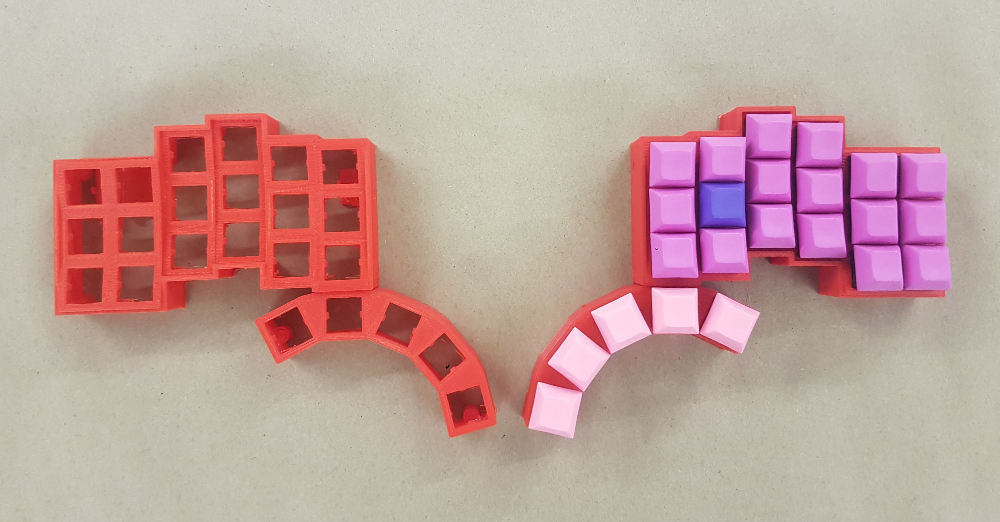
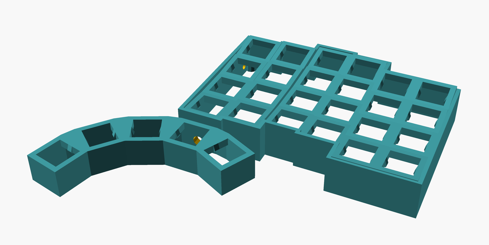

# sulpice

A parameterized ergonomic keyboard in Clojure/OpenSCAD.

Inspired by Dactyl, YaMseK, Keyboardio.

Prototype v2:

OpenSCAD model:

Vaguely resembles the pipe organ console at *Saint Sulpice* in Paris:

